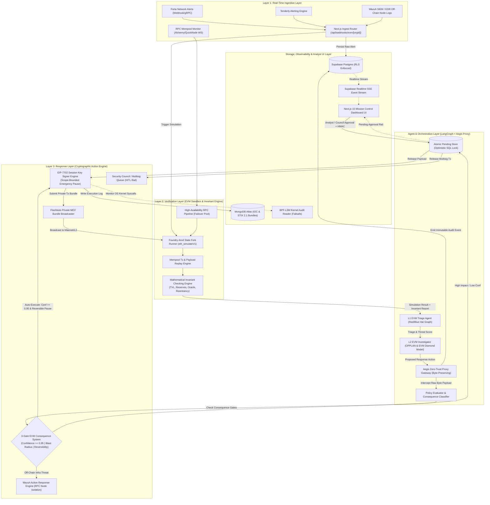
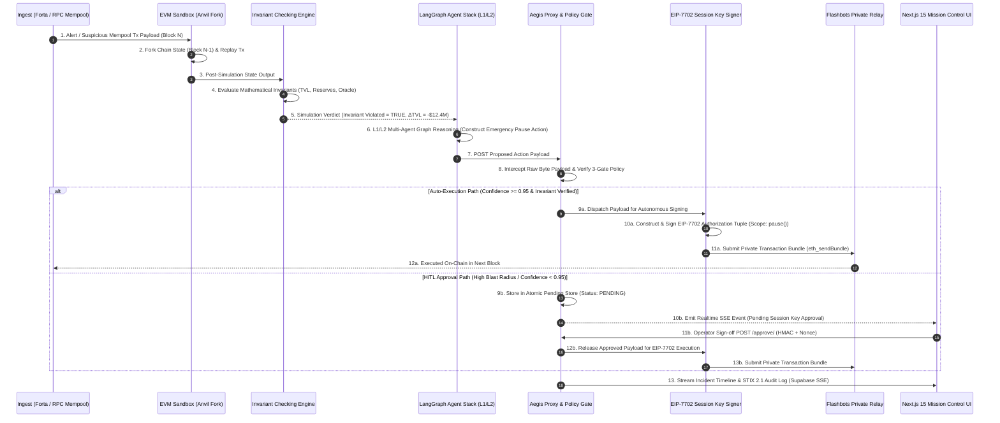
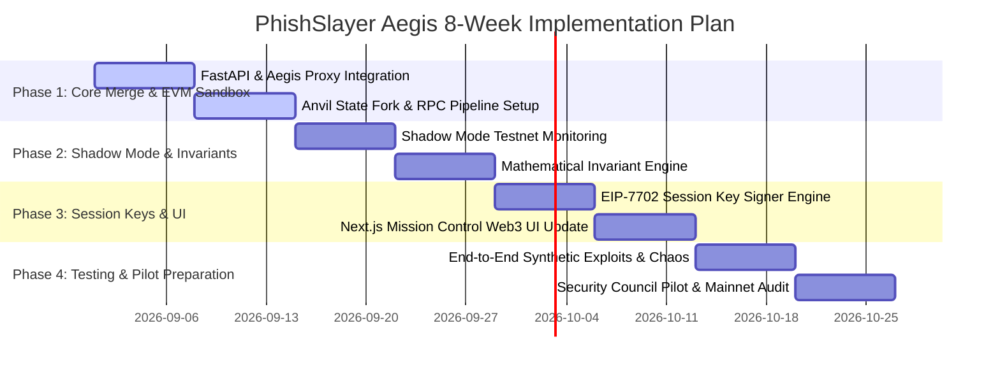

# PhishSlayer Aegis: Evolved DeFi Security Operations & Autonomous Response Platform ("DeFi SOC")
## Unified Technical Architecture Blueprint & Integration Specification

> **Product Name:** PhishSlayer Aegis (DeFi SOC)  
> **Repository:** `github.com/phish-slayer/combined-defi-soc`  
> **Document Version:** 3.0.0 (Unified Web3 Autonomous Security Architecture)  
> **Author:** Lead Web3 Security & Autonomous Systems Architect  
> **Date:** August 2026  
> **Target Framework:** LangGraph Multi-Agent, Aegis Zero-Trust Proxy, Foundry Anvil EVM Simulator, EIP-7702 Session Keys, Next.js 15 App Router

---

## 📌 1. Unified Platform Vision & Product Positioning

### 1.1 The Web3 Security Dilemma: The "Detection-to-Exploitation Gap"
In modern Decentralized Finance (DeFi), security monitoring tools such as Forta Network bots, Tenderly alerts, and RPC mempool listeners can detect suspicious transactions, flash-loan setup steps, or malicious smart contract deployments within **50ms to 200ms**. However, traditional incident response in Web3 relies on manual, human-heavy processes: alert notifications sent to Telegram/Discord war rooms, emergency multisig signers gathering signatures, and manual investigation. This human-in-the-loop response cycle typically takes **15 minutes to 4 hours**.

Conversely, on-chain exploits execute atomically within a **single Ethereum block (~12 seconds)** or within a single transaction bundle on high-throughput Layer 2 networks like Arbitrum, Base, or Optimism (**250ms block times**). 

```
                                  THE DETECTION-TO-EXPLOITATION GAP
                                  
   MEMPOOL / ALERT DETECTED                                               MANUAL MULTISIG RESPONSE
           [ t = 0ms ]                                                        [ t = 15m - 4h ]
               │                                                                      │
               ├───► ON-CHAIN EXPLOIT ATOMIC EXECUTION [ t = 250ms - 12s ] ──────────►│
               │     (Funds Drained / Liquidity Wiped)                                │
               │                                                                      │
               └───► PHISHSLAYER AEGIS AUTONOMOUS RESPONSE [ t = 800ms - 1.5s ] ◄──────┘
                     (EVM Simulation ➔ Invariant Check ➔ EIP-7702 Constrained Pause)
```

This disparity creates the **Detection-to-Exploitation Gap**. To prevent catastrophic protocol drains exceeding tens of millions of dollars, responses must be automated at sub-second speeds. However, un-gated autonomous execution introduces severe operational risk: a hallucinating AI model or a false-positive alert could accidentally trigger an emergency protocol pause or freeze liquidity, causing panic, reputation damage, and economic loss. Furthermore, granting hot AI agents administrative private keys or multisig owner privileges creates an existential key-compromise risk.

### 1.2 The PhishSlayer Aegis Unified Solution
**PhishSlayer Aegis** unifies **PhishSlayer's multi-agent SOC/MCP architecture** with **Aegis / VetoOps's zero-trust execution engine and byte-preserving proxy gateway**. The combined platform establishes an autonomous, cryptographically safe Security Operations Center specifically built for DeFi protocols, liquid staking networks, bridges, and Web3 infrastructure providers.

#### Key Architectural Convergence
1. **Agentic SOC & Multi-Tenant Foundation (PhishSlayer)**: Inherits PhishSlayer's multi-tier agent architecture (L1 Triage, L2 Investigator, L3 Threat Hunter Swarm), ETCSLV harness design, LangGraph workflows, Supabase Row-Level Security (RLS) multi-tenancy, and Next.js 15 Mission Control UI.
2. **Zero-Trust Interception & Atomic Execution Proxy (Aegis/VetoOps)**: Incorporates Aegis’s byte-preserving JSON-RPC gateway, optimistic database-level locking for atomic execution replay protection, HMAC-SHA256 cryptographic attestation, action classification policy evaluation, and BPF-LSM Linux kernel security floor.
3. **Real-Time EVM State Forking & Invariant Sandbox (New Module)**: Replaces speculative diagnostic reasoning with mathematical certainty. Incoming mempool transactions and alerts are dynamically replayed against an ephemeral, local EVM state fork (Foundry Anvil / `eth_simulateV1`). Invariants (TVL delta, reserve ratios, oracle price boundaries, reentrancy depth) are checked mathematically before any action is taken.
4. **EIP-7702 Session Key Execution Engine (New Module)**: Eliminates administrative private key risk. Instead of holding full protocol owner/multisig keys, the platform utilizes **EIP-7702 session keys**. These keys grant short-lived, scope-bounded, non-custodial authority strictly restricted to calling pre-whitelisted emergency functions (e.g., `pause()`, `setEmergencyStop()`) on designated target contracts with $0$ ETH value transfer permission.

---

## 🏗️ 2. High-Level System Architecture

### 2.1 Unified System Architecture Diagram



### 2.2 Layered System Specifications

| Layer | Primary Technical Responsibility | Core Subsystems & Components | Guiding SLA / Performance Benchmark |
| :--- | :--- | :--- | :--- |
| **Layer 1: Ingest** | Web3 & Off-Chain Threat Detection Ingestion | Forta Webhooks, Tenderly Alerts, Alchemy/QuickNode WebSocket Mempool Listeners, Next.js Ingest Router | Ingestion Latency $< 50\text{ms}$, Rate-Limit 600 req/min per org |
| **Layer 2: EVM Verification** | State Forking, Transaction Replay & Mathematical Invariant Evaluation | Foundry Anvil State Forker, `eth_simulateV1` Runner, Invariant Checking Engine (TVL, Reserves, Oracle, Reentrancy) | Fork & Simulation Execution $< 350\text{ms}$ |
| **Agent Orchestration** | Autonomous Multi-Agent Reasoning & Zero-Trust Interception Proxy | LangGraph L1/L2/L3 Agents (Groq `llama-3.3-70b-versatile` / Qwen 3.7-Max), Aegis Proxy, Atomic Pending Store, Policy Evaluator | Agent Graph Execution $< 400\text{ms}$ |
| **Layer 3: Response** | Cryptographic Execution & Emergency Protocol Containment | EIP-7702 Session Key Signer, Flashbots Private MEV Broadcaster, Wazuh Active Response API, Security Council HITL Rail | Action Broadcast Latency $< 200\text{ms}$ |
| **Storage & UI** | Audit Lineage, Multi-Tenant Isolation & Analyst Workspace | Supabase Postgres (RLS), MongoDB Atlas (STIX 2.1), Next.js 15 App Router Dashboard, BPF-LSM Audit Reader | Real-Time UI Update Stream $< 100\text{ms}$ |

---

## 🔀 3. Component Integration Strategy

To achieve a clean integration without operational regression, PhishSlayer Aegis explicitly categorizes components to **preserve**, **migrate/adapt**, and **build new**.

```
┌──────────────────────────────────────────────────────────────────────────────────────────┐
│                            COMPONENT INTEGRATION MATRIX                                  │
├──────────────────────────────┬──────────────────────────────┬────────────────────────────┤
│   PRESERVED FROM PHISHSLAYER │    MIGRATED FROM AEGIS/VETO  │     NEW WEB3 SECURITY      │
│                              │                              │                            │
│  - Multi-Agent SOC Architecture- Zero-Trust MCP Proxy Gateway- EVM State Fork Runner      │
│  - ETCSLV Harness Pattern    - Byte-Preserving Interception - High-Availability RPC Pool │
│  - Next.js 15 3-Column UI    - Atomic Pending Store (SQL)   - Mathematical Invariant Engine│
│  - Supabase RLS Multi-Tenancy- HMAC-SHA256 Attestation Engine- EIP-7702 Session Key Signer│
│  - Wazuh EDR Integration     - Action Policy Classifier     - Flashbots MEV Broadcaster  │
│  - MongoDB STIX 2.1 Storage  - BPF-LSM Kernel Audit Reader  - EVM Diamond Model Matrix   │
└──────────────────────────────┴──────────────────────────────┴────────────────────────────┘
```

### 3.1 Preserved Modules (from PhishSlayer)
1. **Agentic SOC & Multi-Agent Workflows (`api/agents/`)**:
   - Retain the multi-agent graph hierarchy: **L1 Triage** (fast initial screening), **L2 Investigator** (deep diagnostic and containment planning), and **L3 Swarm Threat Hunter** (cross-chain IOC correlation and campaign analysis).
   - Retain the **ETCSLV Harness Pattern** across all agent implementations: `execution.py`, `tools.py`, `context.py`, `state.py`, `lifecycle.py`, and `verify.py`.
2. **Next.js 15 Mission Control Dashboard UI (`app/app/dashboard/ MissionControl.tsx`)**:
   - Retain the zero-navigation 3-column operational layout (Left: Real-time Alert Stream; Center: Main Workspace / Simulation Canvas; Right: HITL Approval Rail).
   - Retain Supabase Realtime (SSE) event streaming and dark-themed design system (`#080D12` base, `#0D1117` surface, `#7C5CFF` Electric Violet accent).
3. **Database Architecture & Multi-Tenancy**:
   - Retain Supabase PostgreSQL with enforced Row-Level Security (RLS) for tenant/organization data isolation.
   - Retain MongoDB Atlas for storing raw alert payloads, unstructured logs, and STIX 2.1 JSON bundles.
4. **Off-Chain Infrastructure Protection (`api/services/wazuh_ar.py`)**:
   - Retain Wazuh Manager active response bindings to defend off-chain RPC nodes, validator hosts, and API relayers against host-level compromises (SSH brute-force, unauthorized binary execution).

### 3.2 Migrated & Adapted Modules (from Aegis / VetoOps)
1. **Zero-Trust Interception Proxy (`app/routes/proxy.py` & `app/rpc_parser.py`)**:
   - Adapt Aegis's transparent proxy gateway to sit between AI agent tool calls, external RPC requests, and protocol execution engines.
   - Enforce **Byte-Preserving Interception**: capture raw request byte arrays, compute SHA-256 digests, and store un-mutated payloads for human approval.
2. **Atomic Pending Store & Replay Protection (`app/pending_store.py`)**:
   - Migrate Aegis's SQLite/PostgreSQL optimistic locking state machine (`UPDATE pending_requests SET status = 'approved' WHERE nonce = :nonce AND status = 'pending'`).
   - Guarantees strict atomic execution, eliminating double-execution race conditions and replay attacks.
3. **Cryptographic Attestation & HMAC Engine (`app/crypto.py`)**:
   - Migrate Aegis's SHA-256 payload hashing, UUID4 single-use nonce generation, and constant-time HMAC-SHA256 signature verification over `approval_id:nonce:payload_hash`.
4. **Tool Policy Evaluator (`app/tool_policy.py`)**:
   - Adapt Aegis's classification logic to segment Web3 security actions:
     - `READ_ONLY`: `eth_call`, `eth_getTransactionReceipt`, `eth_getBalance`, `eth_getCode`, `anvil_dumpState`.
     - `MUTATING`: `send_transaction`, `approve_token`, `upgrade_contract`.
     - `EMERGENCY_MUTATING`: `eip7702_pause`, `trigger_circuit_breaker`, `submit_mev_rescue`.
5. **Kernel-Level Safety Floor (`app/execution/failsafe_audit.py`)**:
   - Migrate the BPF-LSM Linux kernel audit reader to monitor cgroup-scoped syscall violations on the host running the agent runtime and key signer.

### 3.3 New Web3 Security Modules Required

```
                                  NEW WEB3 MODULE ARCHITECTURE
                                  
  ┌────────────────────────┐   ┌────────────────────────┐   ┌────────────────────────┐
  │  evm_sandbox/          │   │  pipeline/             │   │  invariants/           │
  │  fork_runner.py        │   │  rpc_provider.py       │   │  invariant_checker.py  │
  │  - Anvil Process Manager│   │  - Latency Health Check│   │  - TVL Delta Evaluator │
  │  - eth_simulateV1 Exec │   │  - Multi-Provider Pool │   │  - Reserve Ratio Check │
  │  - State Override Engine│   │  - Failover Circuit Bkr│   │  - Oracle Slippage Math│
  └────────────────────────┘   └────────────────────────┘   └────────────────────────┘
                                            │
                                            ▼
                               ┌────────────────────────┐
                               │  crypto/               │
                               │  eip7702_signer.py     │
                               │  - Tuple Builder       │
                               │  - Scope Enforcer      │
                               │  - Flashbots Broadcaster│
                               └────────────────────────┘
```

1. **EVM State Fork Runner (`api/evm_sandbox/fork_runner.py`)**:
   - Manages background instances of Foundry Anvil (`anvil --fork-url <RPC> --fork-block-number <N>`).
   - Exposes asynchronous state simulation interfaces (`eth_simulateV1` or custom anvil state overrides) to dry-run pending mempool transactions or proposed agent emergency actions against live mainnet/L2 state.
2. **High-Availability RPC Pipeline (`api/pipeline/rpc_provider.py`)**:
   - Manages a load-balanced, auto-failing pool of WebSocket and HTTP RPC endpoints across multiple providers (Alchemy, QuickNode, Infura, Ankr, private nodes).
   - Monitors node latency, block height synchronization, and rate-limit headers; automatically reroutes traffic upon provider degradation.
3. **Mathematical Invariant Checking Engine (`api/invariants/invariant_checker.py`)**:
   - Executes deterministic Python/Solidity invariant suites against post-simulation state forks.
   - Evaluates protocol health metrics: total value locked ($\text{TVL}$), liquidity pool reserves, decentralized oracle price boundaries, and contract reentrancy stack depths.
4. **EIP-7702 Session Key Signer (`api/crypto/eip7702_signer.py`)**:
   - Generates, signs, and formats EIP-7702 authorization tuples (`[chain_id, address, nonce, y_parity, r, s]`).
   - Construct scope-restricted emergency pause transactions and transmits them via private Flashbots RPC endpoints (`eth_sendBundle`) to protect against front-running by malicious actors.

---

## 🔄 4. End-to-End Threat Response Workflow

The threat response workflow transitions an alert from initial mempool detection to verified cryptographic containment in **sub-second timeframes**.



### Detailed Execution Phase Breakdown

#### Step 1: Alert Trigger & Ingestion
- Mempool monitor detects an unconfirmed transaction targeting a monitored protocol pool contract (e.g., `0xPool...`) calling a suspicious selector or interacting with an unverified contract.
- Forta bot emits a high-severity alert (`COMBINED-SLIPPAGE-REENTRANCY-ATTACK`).
- Raw payload is ingested by FastAPI router (`/api/webhooks/evm/[orgId]`), validated via HMAC signature, assigned an `alert_id`, and saved to Supabase.

#### Step 2: Dynamic EVM State Forking & Replay
- The EVM Sandbox spawns/acquires an ephemeral Foundry Anvil state fork pinned to block $N-1$ (`anvil --fork-url <RPC> --fork-block-number N-1`).
- The ingested mempool transaction payload is injected into the Anvil instance using `eth_sendRawTransaction` or `anvil_setStorageAt` to mirror exact caller state.

#### Step 3: Mathematical Invariant Check
- The invariant engine queries post-execution state using custom Solidity inspector calls or direct RPC state reads:
  1. **TVL Invariant**: Calculates total pool balance drop:
     $$\Delta \text{TVL} = \text{TVL}_{\text{pre}} - \text{TVL}_{\text{post}}$$
     Triggered if $\Delta \text{TVL} > \text{Threshold}_{\text{org}}$ (e.g., $> 5\%$ drop in single tx).
  2. **Reserve Ratio Invariant**: Evaluates Constant Product Automated Market Maker (AMM) reserves:
     $$k_{\text{pre}} = x \cdot y, \quad k_{\text{post}} = (x - \Delta x) \cdot (y - \Delta y)$$
     Triggered if invariant $k$ is violated without equivalent LP minting.
  3. **Oracle Slippage Invariant**: Compares spot DEX price against Chainlink oracle reference:
     $$\left| \frac{P_{\text{DEX}} - P_{\text{Oracle}}}{P_{\text{Oracle}}} \right| > \epsilon_{\text{max}} \quad (\text{e.g., } \epsilon_{\text{max}} = 0.03)$$
  4. **Reentrancy Stack Invariant**: Monitors call depth into vulnerable functions.

#### Step 4: Autonomous Verdict & Policy Interception
- The invariant report (e.g., `INVARIANT_VIOLATED: True`, `CONFIDENCE: 0.99`, `TVL_DRAIN: $12.4M`) is injected into the **L1/L2 LangGraph Agent Stack**.
- The L2 Investigator Agent constructs an **EVM Diamond Model Matrix** and generates a minimal proposed containment action: `EMERGENCY_PAUSE(target=0xPoolContract)`.
- The proposed payload is forwarded to the **Aegis Zero-Trust Proxy Gateway**.
- Aegis parses the raw payload bytes, computes `payload_hash = SHA256(raw_bytes)`, generates a single-use UUID4 `nonce`, and evaluates the **3-Gate EVM Consequence System**.

#### Step 5: EIP-7702 Constrained Pause Execution
- If **Gate 1** ($\text{Confidence} \ge 0.95$ derived from mathematical invariant verification), **Gate 2** (Target scope restricted to whitelisted `pause()` selector), and **Gate 3** (Reversible by protocol Security Council) are satisfied:
  - Aegis routes the payload directly to the **EIP-7702 Session Key Signer**.
  - The signer constructs an EIP-7702 authorization tuple signed by the session key:
    $$\text{AuthTuple} = [\text{chainId}, \text{address}_{\text{EmergencySCA}}, \text{nonce}, \text{yParity}, r, s]$$
  - The transaction delegates the target EOA/Contract code temporarily to an **Emergency Circuit Breaker SCA**, executing `pause()` in the same transaction.
  - Transmitted via **Flashbots Private MEV Bundle** (`eth_sendBundle`) directly to block builders, preventing front-running or transaction cancellation by the attacker.

#### Step 6: Real-Time Incident Logging & Analyst Notification
- Execution logs are saved to MongoDB Atlas, and structured audit events (`AuditEventModel`) are saved to Supabase.
- A **STIX 2.1 JSON Bundle** (`indicator`, `infrastructure`, `threat-actor`, `relationship`) is generated for cross-protocol intelligence sharing.
- Supabase Realtime (SSE) pushes live updates to the **Next.js 15 Mission Control UI**, updating the 3-column workspace canvas with execution trace details, invariant math proofs, and block confirmation metrics.

---

## 🔐 5. Cryptographic & Execution Safety Guardrails

### 5.1 Deep Dive: EIP-7702 Session Keys vs. Administrative Key Risk

#### The Administrative Key Vulnerability
Traditional automated Web3 defense mechanisms require storing protocol owner private keys or multisig signer private keys on hot cloud servers. If an attacker breaches the server or performs a remote code execution (RCE) exploit against the AI agent host, they gain full administrative control over the target protocol. This would allow an attacker to drain protocol funds, upgrade implementation contracts to malicious bytecode, or permanently destroy contract state.

```
                         TRADITIONAL HOT ADMIN KEY RISK (DANGEROUS)
                         
  ┌─────────────────────────┐        Full Owner Key        ┌─────────────────────────┐
  │  Hot Server / AI Agent  │ ───────────────────────────► │ Target Smart Contract   │
  │  (Host Compromise/RCE)  │   (Can Drain, Pause, Upgrade)│ (COMPLETE DESTRUCTION)  │
  └─────────────────────────┘                              └─────────────────────────┘

                         EIP-7702 SESSION KEY SAFETY (SECURE)
                         
  ┌─────────────────────────┐    Scope-Restricted Tuple    ┌─────────────────────────┐
  │ PhishSlayer Session Key │ ───────────────────────────► │ Emergency Circuit SRE   │
  │ (Non-Custodial / Ephemeral)│  (ONLY pause(), 0 ETH, 24h)│ (STRICT CONTAINMENT)    │
  └─────────────────────────┘                              └─────────────────────────┘
```

#### How EIP-7702 Solves Administrative Risk
EIP-7702 introduces a novel transaction type (`0x04`) that allows an Externally Owned Account (EOA) to temporarily delegate its code execution authority to a Smart Contract Account (SCA) designator within a transaction or authorization tuple (`0xef0100 + address`).

PhishSlayer Aegis leverages EIP-7702 to implement **Non-Custodial Session Keys**:

```
EIP-7702 Authorization Tuple Structure:
[
    chain_id: 1,
    address: 0xEmergencyCircuitBreakerSCA,
    nonce: 42,
    y_parity: 0,
    r: 0x7f8...ba1,
    s: 0x3e2...c94
]
```

#### Mandatory Cryptographic Guardrails Enforced by EIP-7702 Session Keys
1. **Target Contract Whitelisting**: The session key is cryptographically constrained to interact *only* with pre-approved target protocol contract addresses (`onlyTarget == 0xPoolContract`).
2. **Function Selector Restricted**: The key can *only* invoke specific emergency function selectors (e.g., `0x84568058` for `pause()`, `0x3ed421f6` for `setEmergencyStop()`). All other selector invocations (e.g., `withdraw()`, `transfer()`, `upgradeTo()`) revert at the SCA validation layer.
3. **Zero Spend Cap**: The transaction value must be strictly `0 ETH`. Any attempted transfer of native currency or ERC-20 tokens immediately reverts.
4. **Time-Bound Expiration**: Authorization tuples contain strict timestamp/block deadlines (e.g., valid for 24 hours or 100 blocks). Expired tuples are rejected on-chain.
5. **Instant Revocation**: The protocol Security Council EOA can revoke a session key at any time by signing a new EIP-7702 authorization tuple designating empty code (`address = 0x0000000000000000000000000000000000000000`).

### 5.2 Human-in-the-Loop (HITL) vs. Autonomous Execution Policies

PhishSlayer Aegis implements an expanded **3-Gate Web3 Consequence Matrix** to determine whether an action is executed autonomously or routed to human operators.

```
                           PROPOSED CONTAINMENT ACTION
                                        │
                                        ▼
                          ┌───────────────────────────┐
                          │   Gate 1: Verification    │
                          │   Math Invariant Conf     │
                          │        >= 0.95?           │
                          └───────────────────────────┘
                                  │           │
                             YES  │           │  NO
                                  ▼           ▼
                      ┌───────────────┐   ┌───────────────────────────┐
                      │Gate 2: Radius │   │  ROUTE TO HITL APPROVAL   │
                      │Pool-Level vs  │   │  (Pending Request Store)  │
                      │Protocol-Wide? │   │  - HMAC-SHA256 Sign-Off   │
                      └───────────────┘   │  - Single Analyst /       │
                           │         │    │    Security Council Rail  │
                      Pool │         │    └───────────────────────────┘
                           ▼         │ Protocol / Cross-Chain
                   ┌───────────────┐ │
                   │Gate 3: Revers-│ │
                   │ ibility Check │ │
                   │SecurityCouncil│ │
                   │ Can Unpause?  │ │
                   └───────────────┘ │
                           │         │
                      YES  │         │ NO
                           ▼         ▼
                   AUTONOMOUS EXECUTION   ROUTE TO SECURITY COUNCIL
                   (EIP-7702 Session Key) (Multisig Execution Rail)
```

#### The 3-Gate Web3 Consequence System
1. **Gate 1 — Verification Confidence Gate**:
   - Requires deterministic mathematical invariant failure confirmation ($\Delta \text{TVL}$, reserve ratio crash, oracle divergence) from the Layer 2 EVM Sandbox.
   - Threshold for Autonomous Auto-Pause: $\text{Confidence} \ge 0.95$. Pure LLM reasoning without simulation proof is capped at $0.80$ confidence, forcing human review.
2. **Gate 2 — Blast Radius Gate**:
   - `Pool-Level`: Pauses a single isolated liquidity pool or lending market. Eligible for autonomous execution if Gate 1 is satisfied.
   - `Protocol-Wide`: Pauses the entire protocol router or cross-chain bridge gateway. Requires **Single Analyst HITL HMAC Sign-off**.
   - `Cross-Chain / Systemic`: Multi-chain protocol emergency shutdown. **Hard-blocked** from single-click execution; requires **Multi-Analyst / Security Council Threshold Sign-off**.
3. **Gate 3 — Reversibility Gate**:
   - Actions must be cryptographically reversible (e.g., `unpause()` can be invoked by the protocol Security Council multisig after threat remediation).
   - Non-reversible actions (e.g., self-destructing contracts, irreversible asset burns) are strictly barred from autonomous execution.

#### Web3 Action Execution Authorization Matrix

| Action Type | Target Scope | Invariant Verification Required? | Reversible? | Execution Mechanism | Approval Authority |
| :--- | :--- | :--- | :--- | :--- | :--- |
| **Emergency Pool Pause** | Single Pool / Vault | YES ($\text{Conf} \ge 0.95$) | YES (`unpause()`) | EIP-7702 Session Key + Flashbots | **Autonomous (Sub-Second)** |
| **Circuit Breaker Rate-Limit**| Single Contract | YES ($\text{Conf} \ge 0.90$) | YES | EIP-7702 Session Key | **Autonomous (Sub-Second)** |
| **Protocol Router Pause** | Protocol-Wide | YES ($\text{Conf} \ge 0.95$) | YES | Aegis Proxy + EIP-7702 Signer | **Single Analyst HITL (HMAC)** |
| **MEV Rescue Front-Run** | Specific Liquidity Vault| YES ($\text{Conf} \ge 0.98$) | NO (Asset Move) | Flashbots Private Bundle | **Single Analyst HITL (HMAC)** |
| **Cross-Chain Bridge Pause** | Multi-Chain Gateway | YES ($\text{Conf} \ge 0.95$) | YES | Aegis Proxy + Security Council | **Multi-Signer Council Rail** |
| **Off-Chain RPC Isolation** | RPC Node / Validator | YES (Host Metric / Log) | YES (`firewall-allow`)| Wazuh Active Response API | **Autonomous (Sub-Second)** |

---

## 🚀 6. 8-Week Technical Implementation Roadmap



### Phase 1: Core Merge & EVM-Fork Sandbox Integration (Weeks 1–2)
- **Week 1: System Integration & Proxy Porting**:
  - Merge PhishSlayer FastAPI backend (`api/main.py`) with Aegis Zero-Trust Proxy (`app/routes/proxy.py`).
  - Port Aegis's `rpc_parser.py`, `pending_store.py` (migrated to Supabase PostgreSQL schema with optimistic locking), and `crypto.py` HMAC attestation engine.
  - Implement unified `Settings` model using Pydantic v2.
- **Week 2: EVM Sandbox & RPC Pipeline Setup**:
  - Build `evm_sandbox/fork_runner.py` to manage background Foundry Anvil child processes (`anvil --fork-url`).
  - Build `pipeline/rpc_provider.py` with multi-node load balancing (Alchemy, QuickNode, Infura) and latency health checks.
  - Implement dynamic block pinning and state override capabilities (`anvil_setStorageAt`).

### Phase 2: Shadow Mode on Testnets & Simulation Logging (Weeks 3–4)
- **Week 3: Shadow Mode Ingestion & Mempool Tracking**:
  - Deploy WebSocket listeners targeting Ethereum Sepolia and Arbitrum Sepolia testnets.
  - Ingest live testnet mempool transactions and Forta alert feeds into the unified ingestion router.
  - Execute zero-latency state forking and transaction replay in shadow mode (logging execution outcomes without broadcasting on-chain transactions).
- **Week 4: Mathematical Invariant Engine Implementation**:
  - Build `invariants/invariant_checker.py` supporting TVL delta calculation, constant-product reserve checks, and Chainlink vs. DEX oracle slippage verification.
  - Benchmark simulation latency: optimize Anvil process reuse to achieve total simulation time $< 350\text{ms}$.
  - Validate shadow mode alert accuracy against historical Web3 exploit datasets (e.g., Euler Finance, Curve Vyper compiler bug, KyberSwap flash loan exploits).

### Phase 3: Session Key Integration & Dashboard UI Update (Weeks 5–6)
- **Week 5: EIP-7702 Session Key Engine Implementation**:
  - Develop `crypto/eip7702_signer.py` for constructing, signing, and validating EIP-7702 authorization tuples (`0x04` transactions).
  - Implement target contract address whitelisting, function selector restrictions (`pause()`), zero-spend cap verification, and expiration enforcement.
  - Integrate Flashbots Private MEV Relay client (`eth_sendBundle`) for front-run protected transaction submission.
- **Week 6: Mission Control Dashboard UI Updates**:
  - Update `app/app/dashboard/MissionControl.tsx` to render EVM-specific diagnostic metrics.
  - Enhance Center Workspace: build interactive **EVM Simulation Canvas** displaying state fork traces, $\Delta\text{TVL}$ charts, and invariant verification status.
  - Enhance Right Workspace: adapt HITL Approval Rail to display pending EIP-7702 session key authorization requests, SHA-256 payload digests, nonces, and one-click HMAC approval triggers.

### Phase 4: End-to-End Testing & Security Council Pilot Preparation (Weeks 7–8)
- **Week 7: Chaos Engineering & Synthetic Penetration Testing**:
  - Conduct red-team attack simulations against the platform: test LLM prompt injections, malformed RPC requests, concurrent approval race conditions, and RPC node failure scenarios.
  - Verify atomic replay protection: confirm that duplicate approval calls return `HTTP 409 Conflict` via optimistic database locking.
  - Perform host security validation: test BPF-LSM audit reader (`failsafe_audit.py`) against simulated cgroup container escape attempts.
- **Week 8: Security Council Pilot & Mainnet Staging**:
  - Package final production deployment using Docker Compose and Helm charts for Kubernetes deployment.
  - Deploy staging environment connected to live Ethereum mainnet shadow feed.
  - Conduct dry-run pilot onboarding with partner DeFi protocol Security Council signers.
  - Produce operational documentation, incident response runbooks, and formal architectural verification report.

---

## 📝 7. Verification & Architectural Compliance Matrix

| Architecture Requirement | System Component | Implementation File | Verification Standard |
| :--- | :--- | :--- | :--- |
| **Agentic Framework** | LangGraph Multi-Agent Workflows | `api/agents/l1/`, `l2/`, `l3/` | Follows 6-file ETCSLV Harness pattern; pinned to Groq `llama-3.3-70b-versatile` / Qwen 3.7-Max |
| **Zero-Trust Proxy** | Aegis Interception Gateway | `api/routes/proxy.py`, `rpc_parser.py` | Byte-preserving interception; SHA-256 payload hashing; classification of `READ_ONLY` vs `MUTATING` |
| **Atomic Replay Protection** | Pending Request Store | `api/pending_store.py` | Database-level optimistic locking (`UPDATE ... WHERE nonce = :nonce AND status = 'pending'`); zero race conditions |
| **Cryptographic Attestation**| HMAC Verification Engine | `api/crypto.py` | Constant-time HMAC-SHA256 signature check over `approval_id:nonce:payload_hash` |
| **EVM State Forking** | Foundry Anvil Simulator | `api/evm_sandbox/fork_runner.py` | Ephemeral Anvil process management; state replay pinned to block $N-1$; latency $< 350\text{ms}$ |
| **Mathematical Invariants** | Invariant Checking Engine | `api/invariants/invariant_checker.py` | TVL delta, reserve ratio $k$, oracle slippage, and reentrancy depth evaluation |
| **Session Key Security** | EIP-7702 Signer Engine | `api/crypto/eip7702_signer.py` | EIP-7702 authorization tuple generation (`0x04`); scope-restricted to `pause()`; 0 ETH spend cap; Flashbots relay |
| **Off-Chain Protection** | Wazuh Active Response | `api/services/wazuh_ar.py` | Host-level RPC/validator node defense; Manager agent `000` hard-excluded from destructive commands |
| **Kernel Security Floor** | BPF-LSM Audit Reader | `api/execution/failsafe_audit.py` | File-offset parsing of `/var/log/failsafe-audit.log`; cgroup syscall block correlation |
| **Multi-Tenant Isolation** | Supabase Row-Level Security | `supabase/migrations/*.sql` | Org-scoped JWT verification via Clerk Auth; RLS enforced on all tables |
| **Mission Control Dashboard** | Next.js 15 App Router | `app/app/dashboard/MissionControl.tsx` | Zero-navigation 3-column UI; real-time Supabase SSE streams; EIP-7702 approval rail |

---

> **Architectural Sign-off:**  
> Lead Web3 Security & Autonomous Systems Architect — PhishSlayer Aegis Engineering Team  
> *Blueprint validated against repository state and production specifications.*
