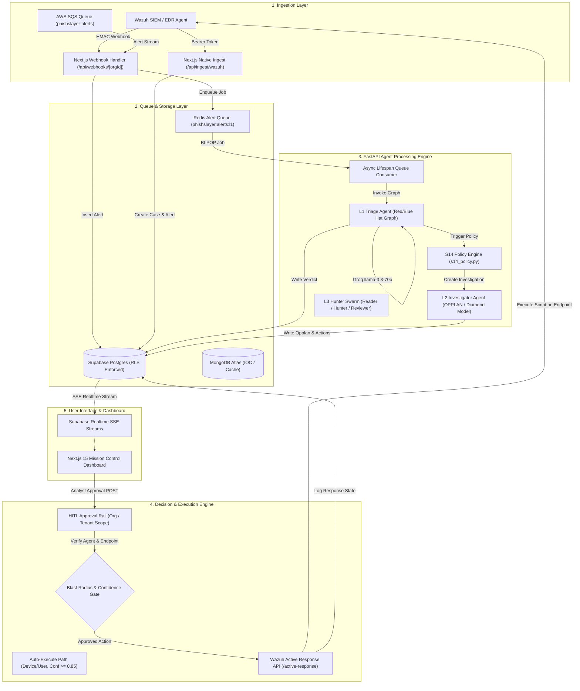
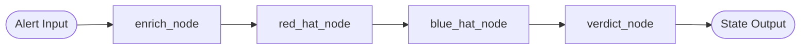
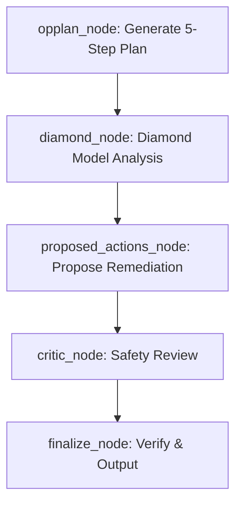
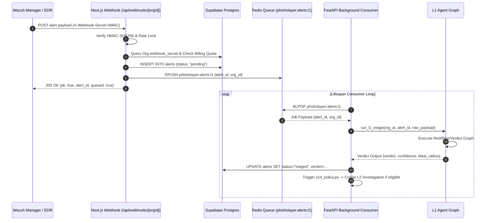
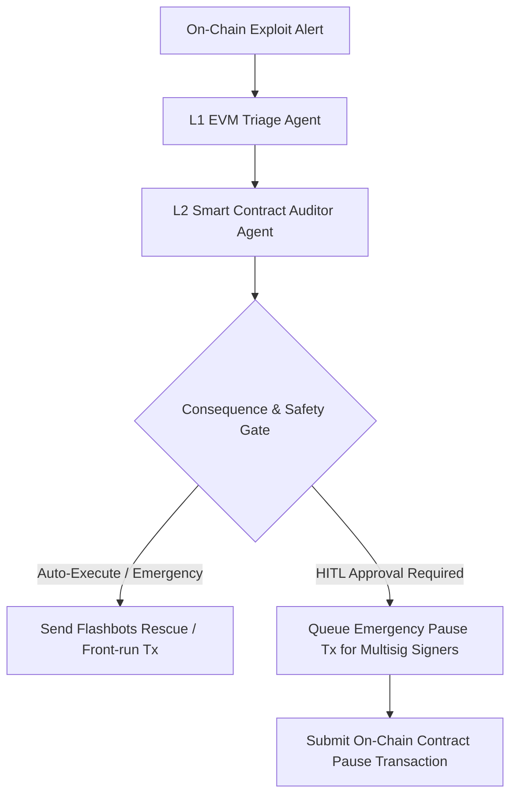

# PhishSlayer Architecture Specification (`phishslayer_architecture.md`)

> **Product Name:** PhishSlayer  
> **Repository:** `github.com/phish-slayer/PhishSlayer-V2`  
> **Company:** Cygnus Ventures SMC-Pvt Ltd  
> **Document Version:** 2.0.0 (Post-S14 / Closed-Loop Active Response & Swarm Engine)  
> **Author:** Lead Cybersecurity Software Architect  

---

## 1. 📌 Executive Summary & Core Mission

**PhishSlayer** is an autonomous, enterprise-grade Security Operations Center (SOC) platform designed for Managed Security Service Providers (MSSPs) and Enterprise SOC teams. The platform automates **Level 1 (L1) alert triage** and **Level 2 (L2) deep incident investigation**, while maintaining a strict **Human-In-The-Loop (HITL)** approval requirement for high-impact actions (Level 3 / organization-wide blast radius).

```
   ┌──────────────────────────────────────────────────────────────────────────────────┐
   │                                PHISHSLAYER SOC                                  │
   │                                                                                  │
   │  ┌────────────────┐     ┌────────────────┐     ┌──────────────────────────────┐  │
   │  │   L1 TRIAGE    │ ──> │ L2 INVESTIGATOR│ ──> │ L3 HUNTER SWARM & HITL RAIL  │  │
   │  │ (Red/Blue Hat) │     │(OPPLAN/Diamond)│     │(STIX 2.1 / Closed-Loop AR)   │  │
   │  └────────────────┘     └────────────────┘     └──────────────────────────────┘  │
   └──────────────────────────────────────────────────────────────────────────────────┘
```

### Core Mission
1. **Accelerate MTTD & MTTR**: Reduce Mean Time to Detect (MTTD) and Mean Time to Respond (MTTR) from hours/days to seconds through automated AI agent graph execution.
2. **Eliminate Analyst Alert Fatigue**: Automatically filter false positives and triage incoming security alerts using dual-perspective (Red-Hat vs. Blue-Hat) adversarial reasoning.
3. **Closed-Loop Threat Containment**: Enforce automated and analyst-approved active responses directly against end-user endpoints and host EDR agents via Wazuh Active Response integration.
4. **Zero-Trust Multi-Tenancy**: Guarantee strict data isolation between MSSP clients and tenant organizations using PostgreSQL Row Level Security (RLS), org-scoped JWT verification, and encrypted BYOLLM key management.

### Architectural Guiding Principles
- **ETCSLV Harness Pattern**: All AI agents are built using a standardized 6-component harness architecture: **Execution** (`execution.py`), **Tool** (`tools.py`), **Context** (`context.py`), **State** (`state.py`), **Lifecycle** (`lifecycle.py`), and **Verify** (`verify.py`).
- **3-Gate Consequence System**: Actions are evaluated against three safety gates before execution: **Confidence Score** ($\ge 0.85$ for auto-execution), **Reversibility** (`true`/`false`), and **Blast Radius** (`user` / `device` vs. `org` vs. `tenant`).
- **Fail-Closed Defensive Mechanics**: When external LLM services experience rate limits or failures, the engine falls back to strict rule-based policy validation (`s14_policy.py`) or safe manual review queues.

---

## 2. 🏗️ Tech Stack Overview

| Category | Technology | Usage & Specification |
| :--- | :--- | :--- |
| **Frontend Framework** | **Next.js 15 (App Router)** | TypeScript, React 19, Server Components, SSR / Client-side hybrid rendering |
| **Styling & UI** | **Tailwind CSS + shadcn/ui** | Custom Dark Theme (`#080D12` base, `#0D1117` surface, `#7C5CFF` Electric Violet accent), JetBrains Mono, Inter |
| **Backend API Engine** | **FastAPI (Python 3.11)** | Asynchronous REST server (Uvicorn), Asyncio background consumer tasks, Pydantic v2 schemas |
| **Primary Database** | **Supabase Postgres** | Instance `txnkvbddcjdldksdjueu`, Row Level Security (RLS) on all tables, Supabase Realtime (SSE alert/investigation updates) |
| **IOC & Document DB** | **MongoDB Atlas** | IOC storage, OSINT cache, case timelines, and unstructured security logs |
| **In-Memory Buffer** | **Redis (`127.0.0.1:6379`)** | Asynchronous alert queue (`phishslayer:alerts:l1`), dead-letter queue (`phishslayer:alerts:deadletter`), API rate limiting |
| **Agent Orchestration** | **LangGraph (`StateGraph`)** | Directed Acyclic Graph (DAG) multi-agent stateful workflow execution |
| **Primary LLM** | **Groq `llama-3.3-70b-versatile`** | Ultra-low latency inference for L1, L2, and L3 agents. Pinned stack model. |
| **Fallback LLMs** | Anthropic Claude / Codex | Fallback support configured via `ANTHROPIC_API_KEY` for high-volume scenarios |
| **Authentication** | **Clerk Auth** | Server-side `auth()` checks, JWT organization claim injection, multi-tenant membership mapping |
| **SIEM & EDR Core** | **Wazuh 4.x** | Manager IP `167.172.85.62`, Active Response API (`/active-response`), agent inventory management |
| **Alert Queue Ingest** | **AWS SQS (`phishslayer-alerts`)** | High-throughput security alert buffering in `us-east-1` |
| **Billing & Payments** | **Polar.sh** | Usage-based alert quota tracking and organization subscription tier management |
| **Development MCP** | **Jetro MCP Server** | Local DuckDB querying, report canvas generation, and document parsing via `.mcp.json` |

---

## 3. 🧩 Core Architecture & Data Flow

### 3.1 End-to-End System Architecture Diagram



### 3.2 Architectural Component Breakdown

1. **Ingestion Layer**:
   - **Wazuh Webhook (`app/app/api/webhooks/[orgId]/route.ts`)**: Validates HMAC-SHA256 signatures against organization secrets stored in Supabase. Enforces billing alert quotas (`alertQuota.ts`) and rate limits (`rate-limit.ts`) before writing raw alert payloads to Supabase and enqueuing them in Redis.
   - **Native Ingestion (`app/app/api/ingest/wazuh/route.ts`)**: Accepts structured alerts via Bearer token authentication, automatically instantiating security cases in `security_cases` and `security_alerts` with full audit trails.

2. **Async Queue & Lifespan Loop (`api/services/queue.py` & `api/main.py`)**:
   - FastAPI initializes a background asyncio task `redis_l1_consumer_loop()` during application lifespan startup.
   - Uses Redis `BLPOP` on key `phishslayer:alerts:l1` with automatic dead-letter queue routing (`phishslayer:alerts:deadletter`) upon unhandled exceptions.

3. **Multi-Agent Engine (`api/agents/`)**:
   - Executes LangGraph workflows powered by Groq `llama-3.3-70b-versatile`.
   - Supports **Bring-Your-Own-LLM (BYOLLM)**: Decrypts org-specific API keys using AES-CBC-256 decryption (`CREDENTIAL_ENCRYPTION_KEY`).

4. **Host Containment Engine (`api/services/wazuh_ar.py` & `response_state.py`)**:
   - Interfaces directly with the Wazuh Manager REST API on port `55000`.
   - Performs target agent validation, excluding Manager agent `000` from destructive actions, and checks agent status (`active_response_eligible == True`).
   - Supports forward containment commands (`firewall-drop`, `host-deny`, `disable-account`, `route-null`) and safety-validated rollbacks (`firewall-allow`, `host-allow`, `enable-account`, `route-restore`).

---

## 4. 🤖 Agentic Workflow & Multi-Agent Design

PhishSlayer organizes autonomous reasoning into three distinct agent tiers: **L1 Triage**, **L2 Investigation**, and **L3 Swarm Threat Hunting**.

```
                           ┌───────────────────────────────────┐
                           │      Wazuh Security Alert         │
                           └───────────────────────────────────┘
                                             │
                                             ▼
                           ┌───────────────────────────────────┐
                           │      L1 Triage Agent Node         │
                           │   (Red-Hat vs. Blue-Hat Dual)     │
                           └───────────────────────────────────┘
                                             │
                                             ▼
                                  Verdict: Suspicious/Malicious?
                                  Confidence >= 0.75?
                                     ├── YES ──> L2 Investigator Agent (OPPLAN)
                                     └── NO  ──> Log Verdict & End
```

### 4.1 L1 Triage Agent (`api/agents/l1/`)

The L1 Triage Agent performs fast threat classification within a **30-second execution window**.



- **`enrich_node`**: Fetches threat intelligence feeds (`tools.py`) and maps alert descriptions to MITRE ATT&CK technique IDs (e.g., `T1110` Brute Force, `T1078` Valid Accounts, `T1068` Privilege Escalation).
- **`red_hat_node`**: Generates an adversarial attack perspective explaining how an attacker could exploit the alert, potential impact, and lateral movement steps.
- **`blue_hat_node`**: Evaluates immediate defensive countermeasures, triage steps, and true/false positive verification strategies.
- **`verdict_node`**: Synthesizes Red/Blue outputs to produce a JSON verdict (`benign`, `suspicious`, `malicious`), a confidence score ($0.0 - 1.0$), and calculates the blast radius (`user`, `device`, `org`, `tenant`).

### 4.2 L2 Investigator Agent (`api/agents/l2/`)

The L2 Agent handles deep incident response and containment planning within a **60-second execution window**.



- **`opplan_node`**: Creates a 5-step operational plan (`step_number`, `description`, `tool`, `expected_output`, `blast_radius`).
- **`diamond_node`**: Maps the incident onto the **Diamond Model of Intrusion Analysis**:
  - *Adversary*: Threat actor profile / source IP.
  - *Victim*: Compromised user, host, or organization asset.
  - *Infrastructure*: C2 IP addresses, hostnames, domain names.
  - *Capability*: Executed malware, commands, or exploits.
- **`proposed_actions_node`**: Recommends host-level remediation actions (`disable-account`, `firewall-drop`, `host-deny`, `route-null`).
- **`critic_node`**: Second LLM invocation reviewing proposed actions for safety, over-scoping, and availability risks before presentation to analysts.

### 4.3 L3 Swarm Threat Hunter (`api/agents/l3/`)

The L3 Hunter Agent is an asynchronous multi-agent swarm executed for deep hunting sessions across IOCs (IPs, Domains, Hashes, URLs, Emails).

```
   ┌──────────────────┐      ┌──────────────────┐      ┌──────────────────┐
   │   Reader Agent   │ ───> │   Hunter Agent   │ ───> │  Reviewer Agent  │
   │(Parse & Classify)│      │(Campaign/MITRE)  │      │(Verdict & STIX)  │
   └──────────────────┘      └──────────────────┘      └──────────────────┘
```

- **Reader Agent**: Parses raw IOC details and classifies threat categories.
- **Hunter Agent**: Correlates threat campaigns, APT groups (e.g., Cozy Bear / APT29), and infrastructure ASNs.
- **Reviewer Agent**: Outputs final threat scores, summaries, and synthesizes **STIX 2.1 JSON Bundles** (`bundle`, `indicator`, `threat-actor`, `relationship`) and OSINT profile structures.

### 4.4 The ETCSLV Harness Specification

Every agent in PhishSlayer follows the strict 6-file structural pattern:

| Component File | Role & Purpose |
| :--- | :--- |
| `execution.py` | Defines the `StateGraph` nodes, edges, entry points, and primary execution wrappers. |
| `tools.py` | Implements domain tools (threat feed lookups, MITRE mapping, blast radius calculation). |
| `context.py` | Assembles organization-scoped context, DB record lookups, and system prompts. |
| `state.py` | Defines `TypedDict` schemas maintaining state across graph transitions. |
| `lifecycle.py` | Handles initialization/teardown of Groq clients, OpenTelemetry, and AgentOps tracking. |
| `verify.py` | Validates final outputs against structural rules and confidence bounds. |

---

## 5. 📊 Ingestion & Alert Processing Pipeline

### 5.1 Alert Ingestion Paths



### 5.2 Billing Quota & Rate Limiting Controls

- **Rate Limits (`app/app/api/_utils/rate-limit.ts`)**:
  - Fixed-window rate limiting backed by in-memory / Redis tokens.
  - Webhooks capped at **60 requests/minute** per IP and org ID. Fail-closed on limit breach (`429 Too Many Requests`).
- **Daily Quotas (`app/app/lib/alertQuota.ts`)**:
  - `free` tier: 50 alerts/day.
  - `pro` tier: 5,000 alerts/day.
  - `enterprise` tier: Unlimited.
  - Resets automatically every 24 hours UTC.

---

## 6. 🛡️ Verification & Decision Engine

### 6.1 The 3-Gate Consequence System

Before any response action is executed on an EDR agent, it must pass through the **3-Gate Consequence Engine**:

```
                          ┌───────────────────────────┐
                          │     Proposed Action       │
                          └───────────────────────────┘
                                        │
                                        ▼
                          ┌───────────────────────────┐
                          │   Gate 1: Confidence      │
                          │      Is score >= 0.85?    │
                          └───────────────────────────┘
                                  │           │
                             YES  │           │  NO
                                  ▼           ▼
                      ┌───────────────┐   ┌───────────────────────────┐
                      │Gate 2: Radius │   │  QUEUE FOR HITL APPROVAL  │
                      │ User/Device?  │   │  (Analyst Review Rail)    │
                      └───────────────┘   └───────────────────────────┘
                           │         │                  │
                      YES  │         │ NO (Org/Tenant)  │ Approved by Analyst
                           ▼         └──────────┐       │
                   ┌───────────────┐            │       │
                   │Gate 3: Revers-│            ▼       ▼
                   │  ibility Check│      ┌───────────────────────────┐
                   └───────────────┘      │   Wazuh Active Response   │
                           │              │     Execution Engine      │
                           ▼              └───────────────────────────┘
                   AUTO-EXECUTE ACTION
```

1. **Gate 1 — Confidence Gate**: Evaluates LLM confidence score. Automated execution requires $\text{confidence} \ge 0.85$.
2. **Gate 2 — Blast Radius Gate**:
   - `user` / `device`: Target single account or single endpoint host. Eligible for auto-execution if confidence gate is met.
   - `org`: Targets organization-wide assets (e.g., subnet firewall drop). Requires **Single Analyst HITL Sign-off**.
   - `tenant`: Multi-tenant impact (e.g., DNS root block). **Hard-blocked** from single-click execution; requires multi-analyst confirmation.
3. **Gate 3 — Reversibility Gate**: Actions must be marked `reversible: true` with a valid rollback target algorithm implemented in `api/services/response_state.py`.

### 6.2 Closed-Loop Active Response & Rollback Engine

#### Supported Forward Containment Commands

| Forward Action | Wazuh AR Command | Target Validation | Rollback Action | Rollback Validation |
| :--- | :--- | :--- | :--- | :--- |
| `disable-account` | `!disable-account` | Safe Linux username (`SAFE_LINUX_USERNAME_RE`) | `enable-account` | Excludes protected accounts (`root`, `ubuntu`, `wazuh`, `sshd`) |
| `firewall-drop` | `!firewall-drop` | Valid IP / CIDR block | `firewall-allow` | Excludes `0.0.0.0/0`, `::/0`, and loopback addresses |
| `host-deny` | `!host-deny` | Single IP or valid hostname | `host-allow` | Excludes wildcards and network subnets |
| `route-null` | `!route-null` | Valid destination route | `route-restore` | Requires original route metadata backup |

#### Endpoint Agent Verification Safety Checks (`api/main.py` & `wazuh_ar.py`)
- **Manager Exclude**: Manager Agent `000` is explicitly rejected from running active responses to prevent accidental SOC manager lockout.
- **Active Response Eligibility**: Endpoints must have `status == "active"` and `active_response_eligible == True` in `wazuh_agents` table.
- **Org Isolation**: Agent mappings are strictly verified against the requesting `org_id` (`get_wazuh_agent_for_org`).

---

## 7. 🔌 API Routes, Integrations & Dashboard UI

### 7.1 Key API Endpoint Reference

#### Next.js 15 Endpoints (`app/app/api/`)

```
POST /api/webhooks/[orgId]           - Wazuh HMAC webhook alert ingestion endpoint
POST /api/ingest/wazuh               - Native Wazuh case/alert ingestion (Bearer Token)
POST /api/actions/approve            - Legacy alert approval endpoint
POST /api/actions/reject             - Legacy alert rejection endpoint
POST /api/decepticon/run             - Triggers host Decepticon red-team simulation
POST /api/hunts/trigger              - Triggers asynchronous L3 threat hunt session
GET  /api/clients                    - List MSSP client organizations
GET  /api/cases                      - List security cases and audit timelines
```

#### FastAPI Endpoints (`api/main.py`)

```
GET  /health                         - Service health check
POST /internal/queue/enqueue         - Enqueue alert job into Redis L1 queue (X-Internal-Key)
POST /internal/queue/process-one     - Process single Redis queue job manually (X-Internal-Key)
GET  /internal/queue/health          - Query Redis queue and dead-letter depth
POST /internal/wazuh/sync-agents     - Sync live Wazuh Manager inventory to Supabase
POST /actions/investigation/approve  - Approve L2 investigation action & execute Wazuh AR
POST /actions/investigation/rollback/check - Dry-run safety check for action rollback
POST /actions/investigation/reject   - Reject proposed L2 investigation actions
POST /decepticon/run                 - Execute host Decepticon attack runner
GET  /decepticon/status              - Fetch Decepticon attack simulation status & alert log
POST /hunts/trigger                  - Trigger L3 threat hunter swarm
```

### 7.2 Mission Control Dashboard UI Architecture

The frontend (`app/app/dashboard/MissionControl.tsx`) implements a **Zero-Navigation 3-Column SOC Workspace Layout**:

```
┌─────────────────────────────────────────────────────────────────────────────────────────┐
│                               PHISHSLAYER MISSION CONTROL                               │
├───────────────────────┬─────────────────────────────────────────┬───────────────────────┤
│   240px ALERT FEED    │          FLEX-1 MAIN CANVAS            │     280px HITL RAIL   │
│                       │                                         │                       │
│  - Realtime Alert     │  - Active Investigation Workspace        │  - Pending Approval   │
│    Stream (Supabase   │  - OPPLAN Execution Steps               │    Action Queue       │
│    SSE)               │  - Diamond Model Matrix                 │  - Blast Radius       │
│  - Severity Badges    │  - MITRE ATT&CK Badges                  │    Indicators         │
│  - Quick Search &     │  - L3 Threat Hunt Canvas                │  - One-Click Approve  │
│    Filters            │  - STIX 2.1 Visualizer                  │    / Reject Buttons   │
└───────────────────────┴─────────────────────────────────────────┴───────────────────────┤
│ Footer Status Bar: Agent Status | Redis Queue Depth | Wazuh Connection | LLM Health    │
└─────────────────────────────────────────────────────────────────────────────────────────┘
```

#### Core Components
- **`L2InvestigationPanel.tsx`**: Renders 5-step OPPLAN, Diamond Model matrix, Critic Agent safety reviews, and execution status logs.
- **`DecepticonPanel.tsx`**: Interactive attack simulation control panel for running 3-stage synthetic attack sequences (SSH brute force, sudo abuse, user creation).
- **`HuntCanvas.tsx`**: Renders L3 threat hunting sessions, STIX 2.1 JSON graphs, and passive DNS / OSINT reputation breakdowns.
- **`OrgSwitcher.tsx`**: Multi-tenant organization switcher supporting tenant isolation for MSSP operators.

---

## 8. ⚠️ Technical Debt, Bottlenecks & Gaps

### 8.1 Current Technical Debt & System Bottlenecks

1. **LLM Rate-Limit Vulnerability**:
   - *Issue*: Heavy reliance on Groq `llama-3.3-70b-versatile` introduces vulnerability to HTTP 429 rate limit spikes during heavy alert bursts.
   - *Current Mitigation*: `S14_DEMO_FALLBACK` rule-based fallback in `l1/execution.py`.
   - *Required Fix*: Implement multi-key Groq API key rotation pools and secondary fallback to local vLLM / Ollama instances.

2. **Single Wazuh Manager Topology**:
   - *Issue*: Hardcoded single Wazuh Manager IP (`167.172.85.62`) and HTTP basic credentials.
   - *Required Fix*: Refactor `WazuhARExecutor` to support high-availability Wazuh Manager clusters with round-robin load balancing.

3. **Single Async Queue Consumer Task**:
   - *Issue*: `redis_l1_consumer_loop()` runs as a single background task inside FastAPI's event loop.
   - *Required Fix*: Extract Redis queue processing into distributed worker processes using ARQ or Celery to scale horizontally under enterprise alert volumes.

4. **Threat Feed Enrichment Mocking**:
   - *Issue*: `get_threat_feed_context` in `l1/tools.py` returns a stubbed score of `0` and empty hits.
   - *Required Fix*: Connect live enrichment APIs for AbuseIPDB, VirusTotal, ThreatFox, and AlienVault OTX.

---

### 8.2 Architectural Roadmap & DeFi / EVM Support Enhancements

To expand PhishSlayer from traditional EDR/SIEM security into **DeFi / Web3 Security Automation**, the system architecture must be enhanced across four key dimensions:

```
┌─────────────────────────────────────────────────────────────────────────────────────────┐
│                              PHISHSLAYER DEFI / EVM EXTENSION                           │
├───────────────────────┬─────────────────────────────────────────┬───────────────────────┤
│  EVM INGESTION LAYER  │            EVM AGENT GRAPH              │  ON-CHAIN CONTAINMENT │
│                       │                                         │                       │
│  - Alchemy / QuickNode│  - Smart Contract Vulnerability Agent   │  - Pause Contract via │
│    WebSockets         │    (Reentrancy, Flashloans, Oracles)    │    Multisig / Timelock│
│  - Mempool & On-Chain │  - Diamond Model Adaptation for EVM:    │  - Blacklist Malicious│
│    Log Monitoring     │    Adversary=EOA, Victim=Pool/Contract  │    EOA via Tether API │
│  - Forta / Blocksec   │    Infrastructure=RPC/Bridge            │  - Front-run / MEV    │
│    Alert Streams      │    Capability=Exploit Contract          │    Rescue Transaction │
└───────────────────────┴─────────────────────────────────────────┴───────────────────────┤
```

#### 1. Ingestion Pipeline Extension (`app/app/api/ingest/evm/`)
- Implement WebSocket listeners consuming real-time EVM logs from Alchemy/Infura nodes and Forta Network security alerts.
- Create specialized Zod schemas for EVM transactions: `hash`, `from_address`, `to_address`, `value`, `input_data`, `block_number`, `gas_price`, `logs`.

#### 2. EVM Intelligence & Threat Feed Skills
- Integrate on-chain threat feeds: **Etherscan Labels**, **Chainalysis Reactor**, **Dune Analytics**, **PhishFort**, and **Blocksec Phalcon**.
- Add bytecode decompilation and static analysis tooling (Slither / Mythril wrappers) into L2 investigator tools.

#### 3. EVM Diamond Model Adaptation

| Diamond Axis | Traditional EDR Context | Extended DeFi / EVM Context |
| :--- | :--- | :--- |
| **Adversary** | Attacker IP / Host | Attacker EOA Wallet Address / ENS Domain |
| **Victim** | Host EDR Agent / User Account | Smart Contract Address / Liquidity Pool / User Wallet |
| **Infrastructure**| C2 Domain / Proxy IP | Malicious RPC Node / Cross-Chain Bridge / Relayer |
| **Capability** | Malware EXE / Bash Script | Exploit Smart Contract Bytecode / Flashloan Payload |

#### 4. On-Chain Automated & HITL Containment Actions



- **Emergency Contract Pause**: Trigger automated circuit breaker calls on pauseable smart contracts (`Pausable.sol`).
- **MEV / Flashbots Rescue**: Submit private Flashbots bundles to front-run ongoing exploit transactions and rescue vulnerable funds to a cold vault.
- **Stablecoin Address Blacklisting**: Automate compliance API calls to Circle (USDC) or Tether (USDT) blacklisting endpoints upon verified malicious asset drains.

---

## 9. 📝 Verification & Compliance Matrix

| Requirement | Implementation File | Verification Status |
| :--- | :--- | :--- |
| **Product Name Compliance** | `AGENTS.md`, `phishslayer_architecture.md` | Verified — "PhishSlayer" used exclusively |
| **Middleware Freeze** | `app/middleware.ts` | Intact & untouched |
| **Dynamic API Routes** | `app/app/api/**/*.ts` | `force-dynamic` + `runtime = 'nodejs'` configured |
| **Zod Schema Validation** | `schemas/wazuh-alert.schema.ts`, `route.ts` | All API payloads validated with Zod |
| **LLM Model Pinned Stack** | `api/agents/l1/execution.py`, `l2/execution.py`, `l3/execution.py` | Pinned to `llama-3.3-70b-versatile` |
| **Supabase RLS Enforced** | `supabase/migrations/*.sql` | RLS active across all tables |
| **Wazuh AR Isolation** | `api/services/wazuh_ar.py` | Manager agent `000` blocked from active responses |
| **Rollback Safety Mechanics** | `api/services/response_state.py` | Target verification algorithm active |

---

> **Architectural Sign-off:**  
> Lead Cybersecurity Software Architect — Cygnus Ventures SMC-Pvt Ltd  
> *Document generated and verified against repository state.*
